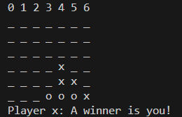

# Testprotokoll
## Programmabsturz
- Das Spiel stürzt ab, wenn man nichts als Spielzug in der Konsole eingibt.
- Wenn man über das Spielfeld hinaus ein Pin plazieren will stürtzt das Spiel auch ab. (Horizontal wie Vertikal)
## Spiellogik
- Wenn man von links nach rechts diagonal gewinnen will, braucht es nur drei Pins und nicht vier.
